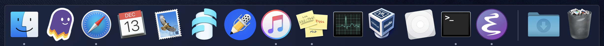

# Bootstrap

``` bash
/bin/bash <(curl -fsSL "https://raw.githubusercontent.com/sclaret/dotfiles/master/bootstrap/github?$(date +%s)")
/bin/bash <(curl -fsSL "https://raw.githubusercontent.com/sclaret/dotfiles/master/bootstrap/dotfiles?$(date +%s)")
```


# Backups

```
Disk Utility
Apple SSD AP0256M Media
Container disk1
Add APFS Volume: workspace
Format 4TB USB HDD GPT / APFS: usb_hdd

System Preferences -> Time Machine
Back Up Automatically
Select Disk: time_machine_backups
Exclude:
Macintosh HD
time_machine_backups
bootable_clone
home_backups
workspace_backups
storage

Get Backup Pro
bootable clone
home
workspace
```


# Vim

https://devhints.io/vim

https://github.com/tpope/vim-fugitive


# Prelude

https://github.com/bbatsov/prelude


# Spacemacs

``` bash
t .emacs.d/ .spacemacs*
git clone -b develop https://github.com/syl20bnr/spacemacs ~/.emacs.d
editing style: vim, distribution: spacemacs
~/.spacemacs
dotspacemacs-configuration-layers
git
markdown
```


# Macos

Short user, host names

```
Software Update

App store
- Xcode

#xcode - Preferences - Locations - Command line tools = "Xcode 10.1"
#xcode-select --install

Setapp

Terminal Preferences - Profiles - Keyboard - Use option as meta key
Terminal Preferences - Profiles - Text - Font 14pt

Setting - General - Appearance Dark, Close windows when quitting an app
Settings - Keyboard - Adjust brightness in low light, Turn backlight off after 30s
Settings - Mission Control - Hot Corners - null, lock screen, put display to sleep, mission control
Settings - Accessibility - Trackpad Options - Enable dragging with 3 fingers, Bump scroll speed
Settings - Trackpad
Settings - Keyboard - Customize Touch Bar

Finder shortcuts: home, workspace, scratch, customize
```




# IDEAS

- exclude from ll (.DS_Store .Spotlight-V100 .Trashes .fseventsd .git)
- split vim / nvim
- inline brew bootstrap script
- shell completion
- tmux
- gopass
- cron
- pull dotfiles
- brew updates
- fileserver
- vpn
- ssh keys vault/agent/keychain
- pipeline builder to filter logs (tl)
- alternate shells
