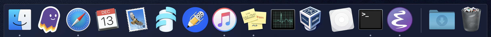

# Apple

```
Short user, host names
echo $USER@$HOSTNAME
sc@mbp.lan

Software Update

App store - Xcode

#xcode - Preferences - Locations - Command line tools = "Xcode 10.1"
#xcode-select --install

Terminal Preferences 
Profiles - Keyboard - Use option as meta key
Profiles - Text - Font 18pt

System Preferences
General - Appearance Dark
Keyboard - Adjust brightness in low light, Turn backlight off after 30s
Mission Control - Hot Corners - null, mission control, desktop, null
Accessibility - Pointer Control - Trackpad Options - Enable dragging with 3 fingers, Bump scrolling speed
Trackpad - Bump tracking speed

Finder 
Favorites
+ home, workspace, scratch 
- Setapp, Documents
Locations, Tags 
Collapse
```




# Backups

```
Disk Utility
Apple SSD AP0256M Media
Container disk1
Add APFS Volume: workspace
Format 4TB USB HDD GPT / APFS: usb_hdd

System Preferences -> Time Machine
Back Up Automatically
Select Disk: time_machine_backups
Exclude:
Macintosh HD
time_machine_backups
bootable_clone
home_backups
workspace_backups
storage

Get Backup Pro
bootable clone
home
workspace
```


# Setapp
